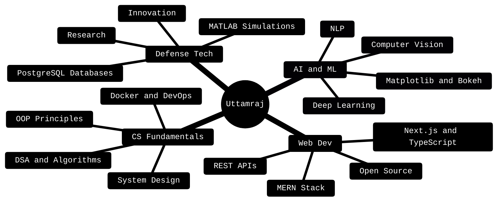

<div align="center">

<!-- Animated Header Banner -->


<!-- Typing Animation -->
<a href="https://git.io/typing-svg">
  
</a>

<br/><br/>


&nbsp;


</div>

---

<table>
<tr>
<td width="55%">

## 🧑‍💻 `whoami`

```yaml
name: Uttamraj Singh
username: codexuttam
location: Delhi, India
pronouns: he/him

currently:
  - Mastering DSA & Competitive Programming
  - Building with MERN + Next.js
  - Exploring AI/ML & Deep Learning
  - Researching Defense Tech

passion: tech + leadership + impact

fun_fact: "something i wanna build which
           I really can't... yet"
```

</td>
<td width="45%" align="center">


<br/><br/>


</td>
</tr>
</table>

---

## 🌐 Connect With Me

<div align="center">

[](https://www.linkedin.com/in/contactuttamraj)
[](https://dev.to/codexuttam)
[](https://bento.me/uttamrajsingh)
[](https://x.com/maiuttamhoon)
[](mailto:uttamrajsingh423@gmail.com)

</div>

---

## 🛠️ Tech Stack

<details open>
<summary><b>💻 Languages</b></summary>
<br/>
<div align="center">


</div>
</details>

<details open>
<summary><b>🌐 Frontend</b></summary>
<br/>
<div align="center">


</div>
</details>

<details open>
<summary><b>⚙️ Backend & Databases</b></summary>
<br/>
<div align="center">


</div>
</details>

<details open>
<summary><b>🧠 AI/ML & Data Science</b></summary>
<br/>
<div align="center">


</div>
</details>

<details open>
<summary><b>🔧 Tools, DevOps & Concepts</b></summary>
<br/>
<div align="center">


</div>
</details>

---

## 📊 GitHub Analytics

<div align="center">


&nbsp;


</div>

<div align="center">


</div>

<div align="center">


</div>

---

## 🏆 GitHub Trophies

<div align="center">


</div>

---

## 🎯 Current Focus



---

## 📈 Contribution Summary

<div align="center">


&nbsp;


</div>

---

## 💡 Quote of the Day

<div align="center">


</div>

---


<div align="center">

**⭐ If you find my work interesting, drop a star! ⭐**

*"The best way to predict the future is to create it."*

</div>
